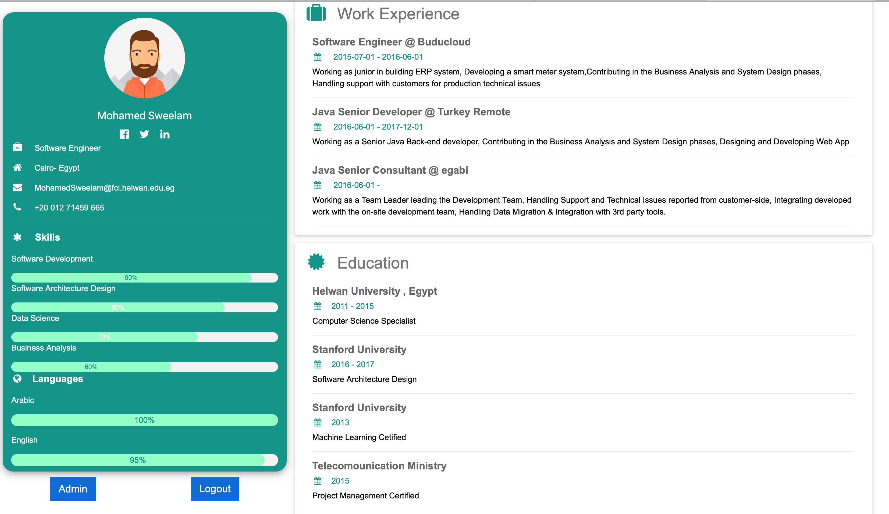

# Web-based-CV
 A demo for building web-based cv in microservices architecture, the application contains third party tools like redis and docker platform.
 Languages and Frameworks:
  1. Java 8+
  2. Spring Boot
  3. Spring Cloud
  4. Angular 6+

# System Architecture Diagram 
 The source code for the demo is following the recommened architecture from Spring cloud project, and include most of the components shown in this diagram, plus some other needful stores like <strong>Redis</strong>
 
 
# Snapshot for the Demo 
The UI (Angular code) is only as Proof of Concept (POC) for the implemented backend.


# Setup
 To run the system locally using the same database, you need to do the following:
 ```sql
   1. Run the docker-compose file under web-based-cv directory `docker-compose up` 
   5. If you need to change databse credentials, you can update <strong>properties</strong> table details 
 ```
# Running Steps
  To start the application through docker without IDE you need to start server shell file using 
  ``` shell-script
  ./server-start.sh
 ```
  To Login in frontend use username/password : Sweelam/sweelam
      
